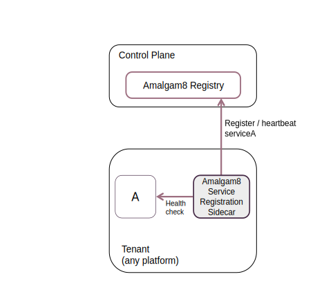
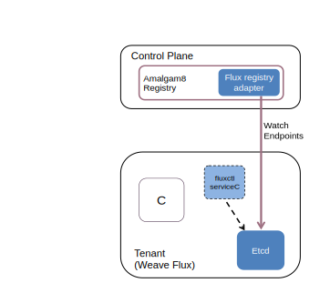
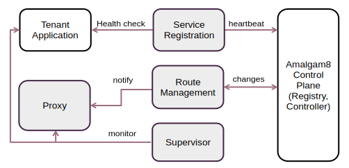
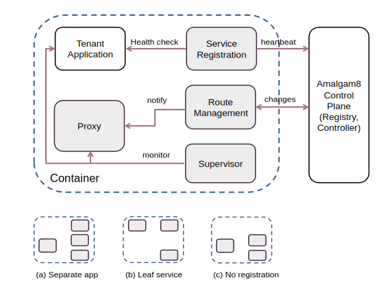
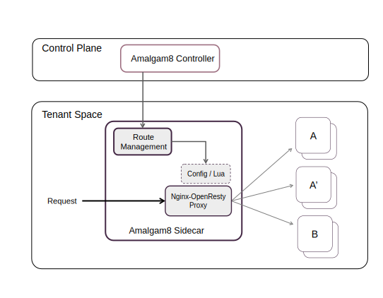
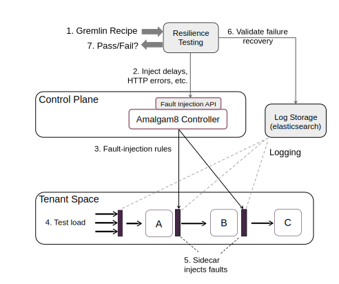

Amalgam8 is a multi-tenant platform for quickly building
[microservice applications](http://martinfowler.com/articles/microservices.html)
and managing the DevOps lifecycle aspects of various microservices.
Its goals are to simplify integration of polyglot microservices and help
developers accomplish DevOps tasks such as
[A/B testing](https://www.optimizely.com/ab-testing/),
[canary releases](http://martinfowler.com/bliki/CanaryRelease.html),
red/black deployments,
[resilience testing](https://developer.ibm.com/open/2016/06/06/systematically-resilience-testing-of-microservices-with-gremlin/),
etc.

The Amalgam8 platform achieves these goals through two stages. First, a
language-agnostic sidecar process enables developers to quickly integrate
polyglot microservices by abstracting away service registration, discovery,
load-balancing from the application process.

Second, a centralized control plane programs the sidecars at runtime to
control traffic across different versions of microservices
(both edge and mid-tier), and manipulate/transform requests based on various
rule. Using the control plane APIs, developers can
easily perform tasks such as canary releases, red/black deployments,
version-aware routing, A/B testing, failure recovery testing (resilience
testing), etc.

Due to its native support for multi-tenancy, the Amalgam8 control plane can
be easily integrated into any multi-tenant infrastructure (e.g., IBM
Bluemix, AWS, Azure, etc.), thereby providing application developers with a
consistent interface for building and managing their microservice
applications across different providers.

The Amalgam8 platform can run on any compute infrastructure such as
containers, VMs or even bare metal. It easily integrates with popular
container management solutions such as Docker Swarm, Kubernetes,
Marathon/Mesos. In addition, it can run on various public cloud
infrastructures such as IBM Bluemix, Google Cloud Platform, etc.

<!-- Amalgam8 provides proxy and registration sidecars and other adapter mechanisms that are used for registering and calling -->
<!-- microservices. Depending on a microservice's deployment runtime, integration with Amalgam8 can require little or no significant change -->
<!-- to the microservice implementation code because Amalgam8 is designed to leverage the benefits of any given runtime -->
<!-- and then provide the easiest possible integration for each. For example, in Kubernetes, a microservice that already has an associated -->
<!-- Kubernetes service definition can be registered automatically using an Amalgam8 plugin providing -->
<!-- an adapted view of the Kubernetes services in Amalgam8.  -->
<!-- Similar plugins are possible for other runtime environments, but where they are not, Amalgam8 also provides registration -->
<!-- and proxy functionality using sidecars in a number of predefined, but extensible, container images. -->

<!-- In addition to ease of integration, Amalgam8 also provides the integrated microservice-based applications with core functionality -->
<!-- enabling a great deal of control and testability, addressing some of the most challenging issues faced when moving to -->
<!-- a microservices-based system. This includes edge and mid-tier version-routing based on traffic percentage, user, and other -->
<!-- criteria. Delays and failures can also be injected into the path of calls to and between microservices, enabling advanced -->
<!-- end-to-end resiliency testing. And most importantly, all of this is designed for extensibility and is completely available in open source. -->

## How Amalgam8 Works 

The Amalgam8 platform consists of the following three components:

1. **Registry** - A high performance multi-tenant service registry that
   provides a centralized view of all the microservices in an application,
   regardless of where they are actually running. To simplify integration
   of microservices that are already using a service registry, Amalgam8
   registry provides a plug-in point for adapters that can automatically
   pull in information from
   other service registry solutions such as Etcd (used by Kubernetes),
   Netflix Eureka, Consul, etc.

2. **Controller** - A multi-tenant controller that monitors the registry
   and updates the sidecar configuration accordingly. It provides APIs to
   the developer for configuring request routing across different versions
   of microservices, fault injection, etc. These controller generates
   request routing rules and updates the sidecars belonging to the
   developer's application.

3. **Sidecar** -  Each microservice in the application is paired with a
   sidecar. Conceptually, the sidecar's basic responsibility includes service
   registration (where required), service discovery and *client-side load-balancing* of
   requests across microservice instances. In addition to these basic
   responsibilities, the sidecar is responsible for essential functions
   such as version-aware routing, fault injection, ACLs, rate limiting,
   etc. From a design standpoint, the choice of technology for the sidecar
   is irrelevant. *Any implementation of the sidecar is sufficient (as a
   library or a helper process) as long as the sidecar performs the above
   functions and is dynamically programmable at runtime*.
   
Amalgam8's sidecar implementation uses OpenResty + Nginx for request
routing, and employs a simple daemon for receiving and updating the routing
rules in Nginx, and for service registration & heartbeat (where needed).

Applications run as tenants of the Registry and the Controller. They
register their services in the Registry and use the Controller to manage
the sidecars. The following diagram illustrates how the three components
work together.

1. Microservice instances are registered in the Registry. There are several
   ways this may be accomplished as described in
   [Amalgam8 Registry](#service-registration).
2. The Developer uses the control plane API to configure high-level rules
   for request routing between services (e.g., splitting traffic across
   versions, injecting delays).
3. The Controller translates these rules into low-level control information
   and sends them to the sidecars. In addition, it also sends control
   information when new information (e.g., new services, new instances)
   appears in the Registry.
4. A microservice invokes APIs of other microservices by pointing to the
   sidecar as the destination host. For e.g., http://localhost:6379/servicefoo/foobarapi
5. The Nginx proxy component of the sidecar forwards the request to the
   appropriate microservice, depending on the request path and routing
   rules specified by the controller.

## Amalgam8 Registry 

To integrate and use a microservice in Amalgam8, it needs to be registered
in the Amalgam8 Registry.  The most basic way of registering, which can be
used for microservices running on any platform / runtime, is shown in the
following diagram:

The Amalgam8 sidecar is used to register and continuously send heartbeats
to the registry on behalf of a microservice instance. In addition, the
sidecar keeps track of the health of the application (microservice A in the
figure above) and stops sending heartbeats if or when it terminates, soon
after which the registration in the Amalgam8 Registry will expire and be
removed.  Note that if the sidecar is unable to send heartbeats to the
Registry for some reason (say network disruption), the service's entry in
the Registry might expire, causing the instance information to be removed
from the Registry. In other words, the instance will become unavailable to
other microservices. When the sidecar re-establishes connectivity with the
Registry, it re-registers the service.  This is a common service
registration design pattern used in many microservice frameworks, and will
work for services running anywhere.

### Interoperability with other service registries 

A key design feature of Amalgam8 Registry is to leverage features of any
particular runtime platform that a microservice may be deployed in.  The
Registry supports the concept of adapters -- pluggable modules that can be
used to populate the Registry with information from other sources instead
of the sidecar, such as Etcd, Consul, Kubernetes' internal registry,
etc. Currently, the Registry provides an adapter for Kubernetes, and can be
used as a drop-in replacement for Netflix Eureka, with the added feature of
multi-tenancy.

#### Kubernetes-Registry Adapter

A microservice running in Kubernetes with a corresponding service
definition, will already have the endpoints (instances) being tracked by
the Kubernetes runtime (kubelet) and reflected in the Kubernetes service
registry. Instead of using the sidecar to explicitly registering this
service once again in the Registry, Amalgam8 provides a Kubernetes
adapter. The adapter can be configured to watch the Kubernetes registry and
automatically mirror the endpoints in Amalgam8 as shown in the figure
below.

In the above figure, service B is a Kubernetes service defined in
serviceB.yaml. There is nothing that needs to be added or changed to
integrate it with an Amalgam8 system. Instances, as they come and go, will
be maintained in the Kubernetes registry by the Kubernetes runtime, and
then automatically mirrored in the Amalgam8 Registry by the
kubernetes-adapter.

Similar adapter plugins can be added to support other runtime environments
where service registration is automatically managed by the container
platform.  For example, a Docker environment with
[Weave Flux](http://weaveworks.github.io/flux/) allows services to be
defined using the fluxctl command, the endpoints of which are then
automatically tracked and reflected in its Etcd registry. Integration with
Amalgam8's Registry could be done in a manner similar to the Kubernetes
adapter.

<!--  -->

<!-- The main point is that the Amalgam8 registry is designed to be open to these kinds of extensions, so that integrating a service into -->
<!-- Amalgam8 can be as easy as possible in each particular case. -->

## Amalgam8 Sidecar 

The Almagam8 sidecar has a flexible architecture that can be configured and
used by applications in a number of ways. The sidecar can be split into the
following functional components:

* **Service Registration** - Registers a microservice instance in the Registry and sends periodic heartbeats.
* **Route Management** - Receives route updates from the Controller and updates the Proxy without disruption.
* **Supervisor** - Manages the lifecycle of an Amalgam8 Proxy server and optionally the associated microservice itself.
* **Proxy** - An [OpenResty-based Nginx](https://openresty.org/en/) server  that acts as a request forwarder and load-balancer.

**Deployment Options:** There are two deployment options for the
sidecar. One option is to run it as *a separate process in the same
container alongside the application*. This usage model applies to any
container-based environment and requires that the sidecar binaries be
bundled along with the application in the same Docker image. Amalgam8
provides convenient Docker images packaged with the sidecar, that can be
used as microservice application base images. The sidecar binary can also
be built and installed individually or be distributed as installation
packages (e.g., deb, rpm, etc.).

Another option, specific to Kubernetes, is to run a sidecar container per
pod. Each pod would have the microservice running in one container and the
sidecar in another. In both deployment options outlined above, the
application would access the sidecar in the same manner, namely:
http://localhost:6379/servicefoo/foobarapi

**Configurations:** Depending on the nature of the microservice, only some
or all of the components of the sidecar may be needed. As shown in the
figure below, a microservice that requires service registration, makes
outbound calls to other microservices, and requires app supervision might
use all of the components of the sidecar. On the other hand, a leaf
microservice that does not make any outbound calls requires only the
service registration component of the sidecar (b). In Kubernetes, the
sidecar would typically be deployed as a separate container without the app
(a). Service Registration would not be needed for services in a runtime
that supports auto registration (c), for example, when using the amalgam8
registry adapter for Kubernetes.  The sidecar provides various
[command line flags](https://github.com/amalgam8/sidecar) to disable
components that are not needed.

### Proxy 

All calls to Amalgam8 microservices are routed via the Proxy component in
the sidecar. The Proxy enables the Amalgam8 Controller to manage traffic
between all the microservices in the application. Typically, the Proxy
component is deployed in the sidecar configuration, thus serving as a
decentralized client-side load-balancer. There are two exceptions that
should be noted:

- If the application owner wishes to use the DevOps functions for
  user-facing microservices, an instance of the sidecar with just the Proxy
  component needs to be deployed as an API gateway, in front of the
  user-facing microservices.
- By routing API calls to third-party services such as social media, maps,
  etc., via the Proxy component, it is possible to leverage DevOps functions 
  such as failure-recovery testing between the microservice and third-party
  dependencies.

The Amalgam8 Proxy implementation uses [Nginx](https://nginx.org/en/) with
the [OpenResty/Lua](https://openresty.org/en/) extension as the Proxy
engine as shown in the following diagram:

The Route Management component of the sidecar process queries the Amalgam8
Controller, in the control plane, to obtain the routing and configuration
information for the Nginx servers. The sidecar updates Nginx via REST API
exposed by the Lua-based management layer in the Nginx proxy.

At the Nginx layer, incoming requests are passed on to the the appropriate
Lua functions, which will route the request to an appropriate service, or
version of a service, and then load balance to an appropriate instance.

A point worth highlighting is that although Amalgam8 includes convenient
sidecar container images with built-in implementations of some of the most
common proxy control features, the design is open and intended to allow
applications to extend the behavior by introducing their own custom routing
rules and control logic.  Specific rules provided to the Amalgam8
Controller can be considered opaque and will essentially be passed though
to the proxys that are intended to act on them. So, by simply extending the
sidecar implementation to include matching Lua implementation code, custom
rules can be specified and the system will behave as expected.

<!-- ## Resilience Testing  -->

<!-- The ability to inject into and affect the API calls between microservices provided by Amalgam8 proxies, -->
<!-- enables another very powerful feature of Amalgam8. -->
<!-- Isolated end-to-end testing can be run on live systems without impacting the microservices. -->
<!-- Amalgam8 allows you to inject different types of faults (e.g., delays, -->
<!-- return HTTP errors, terminate connections, etc.) into the call path between microservices -->
<!-- and then analyze the behavior provided by log messages from the Amalgam8.  -->

<!--  -->

<!-- Using the integrated [Gremlin SDK](https://github.com/ResilienceTesting/gremlinsdk-python), -->
<!-- Amalgam8 users can also perform systematic resilience testing with reproducible failure scenarios and assertions to -->
<!-- test and debug complex microservice-based applications end-to-end. -->
